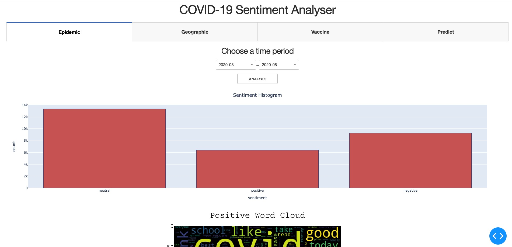
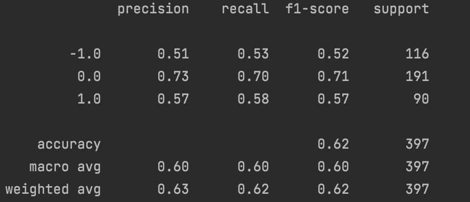
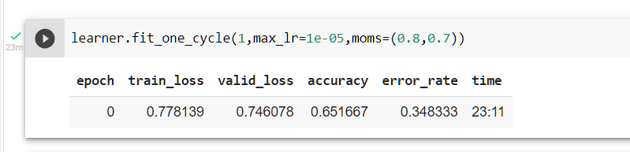

# CourseProject of CS410
## **Sentimental Analysis on Covid-19 related tweets**
### **Project Overview**



The purpose of this project is to generate a sentimental analysis of tweets that are related to Covid-19. Our goal is to use data that we collect online to train a well-performed model and use the trained model for analyzing the sentiment (i.e., negative, neutral, and positive) of Twitter users towards Covid-19 and vaccines. 

In this project, we developed and trained two models based on the data we collected from Twitter using Tweepy and online datasets. We have collected over 4,800,000 tweets from 07/26/2020 to 06/25/2022 and manually labeled over 3000 tweets (a random sample of 10 tweets per day for 300 days) pulled using Twitter API. We defined keywords including ["Covid", "Vaccine"] and pulled tweets that mention the keywords. The analysis adapted an online dataset that includes more than 50k tweets as well.
  Note: Due to the requirements of Twitter API, we cannot publish our tweet content datasets directly in this repository. Please use the following Google Drive link to download the datasets to run our application.
  https://drive.google.com/drive/folders/1WkHKEbWaAFimRCzSoXpZqBTbuUxJAmpH?usp=sharing

We have trained two models, one using log regression and the other one adpated bert model from [HuggingFace](https://github.com/huggingface/transformers).  

We have also presented our results using Dash APP, with following options that user can choose from:
1.  users can select the different time ranges of the tweets and view the sentimental analysis results. 
2.  View analysis based on different countries.
3.  How twitter users feel about vaccines in general or based on the specific brand.
4.  Predict user-entered information.

**Team Member Contribution:**

- Chun Yang (chuny2@illinois.edu) University of Illinois Urbana Champaign
  1. Preprocessd and labeled data for model training 
  2. Trained Bert Model with FastAI
  3. Responsibled for data visulizations on geographic infomation for the Dash application
  4. Presentation
- Fan Zang (fanzang2@illinois.edu) University of Illinois Urbana Champaign
  1. set up Twitter developer app to search tweets and sample real-time tweets
  2. train linear-regression model using SEM Eval dataset and manually labeled COVID-19 tweets
  3. use TextBlob API to analyse subjectivity of tweets
  4. work on data visualization of time ranges based sentimental analysis
- Yanlin Liu (yl128@illinois.edu) University of Illinois Urbana Champaign
  1. Manually labeled tweet data
  2. Registered Elevated Access of the Twitter Developer account to pull tweets
  3. Hydrated tweets (retrieve tweet content) from 07/26/2020 to 06/25/2022 using tweet id and Tweepy API
  4. Performed data visualization of the sentimental analysis of tweets related to vaccines

### **Project Pipeline**
- Data collecting and cleaning
- Model training
  - Log Regression model
  - Bert Model
- Sentimental Analysis with the model
- Multiple Analysis based on filtered information
- Present the results using Dash

### **Source Code Overview**
Hydrate tweet content:
- hydrate_tweet.ipynb
  1. retrieve tweet content using Twitter API and tweet id
  2. (optional) preprocess tweet content and replace emojis with meanings in text

Train Model and Predict:
- twitter.py:
  1. use Tweepy API to search COVID-19 tweets based on date and id
  2. retrieve pulled tweets based on time period
  3. preprocess tweets for later prediction and model training
- log_regression.py: 
  1. use scikit-learn vectorize tweets, convert to bag of words model
  2. use scikit-learn train a log regression model and analyse model precision
  3. load trained model to predict sentiment of given tweets
- text_blob.py: 
  1. use TextBlob API to analyse text subjectivity
  2. compare result from TextBlob sentiment analyser with COVID-19 specialized model
- bertmodel.ipynb:
  1. preprocessed data
  2. configured customer transformer model, tokenizer to adpat fastai

### **Running the project**
*Optional: using conda to create an environment for this project*
```
conda create -n py39 python=3.9
```
First clone the project on local environment
```
git clone https://github.com/FanZang-Allen/COVID-SENTIMENT.git
```
Then install requirements using 
```
pip install -r requirements.txt
```

Then run the application with 
```
python dashApp.py
```
Then the Dash app should be running locally at http://127.0.0.1:8054

### **Model Performance**
1. **Log Regression Model**
   
2. **BERT model adapted form transformers & fastai**
   
   

   Our trained model can be downloaded from [Google Drive](https://drive.google.com/file/d/1bUVhccCEOrL_WnFDj32_BBKWLwXr27xh/view?usp=sharing)


**Related Work:**

Dataset:
- [COVID-19 Twitter Dataset with Latent Topics, Sentiments and Emotions Attributes](https://www.openicpsr.org/openicpsr/project/120321/version/V12/view?path=/openicpsr/120321/fcr:versions/V12/Twitter-COVID-dataset---June2022&type=folder)
- [SemEval-2017 Task 4: Sentiment Analysis in Twitter](https://arxiv.org/abs/1912.00741)
- [Covid-19 Twitter chatter dataset for scientific use](https://github.com/thepanacealab/covid19_twitter#covid-19-twitter-chatter-dataset-for-scientific-use)
  
References: 
- [Dash](https://dash.plotly.com/)
- [Log Regression Model Beginner Guide](https://towardsdatascience.com/a-beginners-guide-to-sentiment-analysis-in-python-95e354ea84f6)
- [Fastai with 🤗Transformers (BERT, RoBERTa, XLNet, XLM, DistilBERT)](https://towardsdatascience.com/fastai-with-transformers-bert-roberta-xlnet-xlm-distilbert-4f41ee18ecb2)
- [Social Media Mining Toolkit (SMMT)](https://github.com/thepanacealab/SMMT)

   
